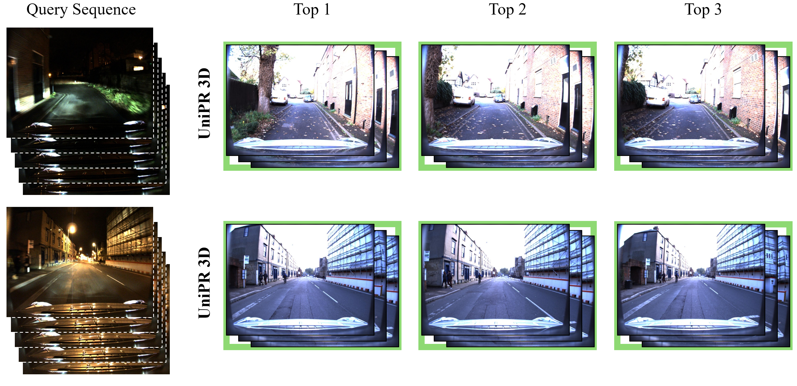
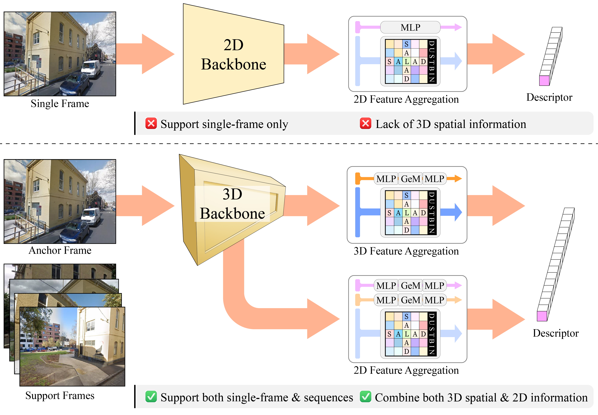

<p align="center">

  <h2 align="center">UniPR-3D: Towards Universal Visual Place Recognition with 3D Visual Geometry Grounded Transformer</h2>
  <p align="center">
    <strong>Tianchen Deng</strong><sup>1</sup>
    ·
    <strong>Xun Chen</strong><sup>2</sup>
    ·
    <strong>Ziming Li</strong><sup>1</sup>
    ·
    <strong>Hongming Shen</strong><sup>2</sup>
    ·
    <strong>Danwei Wang</strong><sup>2</sup>
    ·
    <strong>Javier Civera</strong><sup>3</sup>
    ·
    <strong>Hesheng Wang</strong><sup>1</sup>
</p>

<!-- <p align="center"><strong>International Conference on 3D Vision (3DV) 2025</strong></a> -->
<p align="center">
    <sup>1</sup>Shanghai Jiao Tong University· <sup>2</sup>Nanyang Technological University· <sup>3</sup>University of Zaragoza
</p>
   <h3 align="center">

   <!-- [](https://arxiv.org/abs/2408.10154) [](https://loopsplat.github.io/) -->
   [](https://opensource.org/licenses/MIT)
  <div align="center"></div>
</p>


<p align="center">
  <a href="">
    
  </a>
</p>

## 📃 Description
<p align="center">
  <a href="">
    
  </a>
</p>

**UniPR-3D** is a universal visual place recognition framework that supports both frame-to-frame and sequence-to-sequence matching.
Our model is capable of predicting visual descriptors for both individual frames and entire sequences. It leverages 3D and 2D tokens with tailored aggregation strategies for robust single-frame and variable-length sequence matching, achieving state-of-the-art performance on benchmarks like MSLS, Pittsburgh, NordLand, and SPED.
# 🛠️ Setup
The code has been tested on:

- Ubuntu 22.04 LTS, Python 3.11.10, CUDA 12.1, GeForce RTX 4090

## 📦 Repository

Clone the repo:

```
git clone https://github.com/dtc111111/UniPR-3D.git
cd UniPR-3D
```

## 💻 Installation
We provide a docker file for easy setup. To build the docker image, run:
```
docker build -t unipr3d -f DOCKERFILE .
```
To run the docker container, use:
```
docker run --gpus all -it unipr3d /bin/bash
```
You may need to mount your data directory to access the datasets, e.g., add `-v /path/to/your/data:/data` to the above command.

# 🚀 Usage
## Downloading Pretrained Models
  You may download our pretrained models from <a href="https://huggingface.co/SJTU/UniPR-3D/tree/main">hugging face</a> or from release and place them anywhere you like.

## Downloading the Datasets
  If have to download following datasets to evaluate our method or reproduce our results.

  **For training:**
  We use <a href="https://www.mapillary.com/dataset/places">Mapillary</a> (MSLS) (<a href="https://github.com/mapillary/mapillary_sls">github repo</a>) dataset for training our model. (52G)

  **For evaluation:**
  Apart from MSLS Validation, we use several datasets for evaluation:
  - Two sequence from <a href="https://robotcar-dataset.robots.ox.ac.uk/datasets/">Oxford RobotCar</a>, you may download them <a href="https://entuedu-my.sharepoint.com/personal/heshan001_e_ntu_edu_sg/_layouts/15/onedrive.aspx?id=%2Fpersonal%2Fheshan001%5Fe%5Fntu%5Fedu%5Fsg%2FDocuments%2Fcasevpr%5Fdatasets%2Foxford%5Frobotcar&viewid=e5dcb0e9%2Db23f%2D44cf%2Da843%2D7837d3064c2e&ga=1">here</a>.
    - 2014-12-16-18-44-24 (winter night) query to 2014-11-18-13-20-12 (fall day) db
    - 2014-11-14-16-34-33 (fall night) query to 2015-11-13-10-28-08 (fall day) db
  - <a href="https://github.com/gmberton/VPR-datasets-downloader/blob/main/download_nordland.py">Nordland (filtered) dataset</a>

  Before training or evaluation, please download the dataset and replace the paths with your own paths in `/dataloaders/*`

## Training
  To reproduce our results and train the model, run:
  ```
  python3 main_lora_multiframe.py
  ```
  Make sure to set the correct paths in the python file before running.

## Evaluating
  To evaluate the model on datasets mentioned above, run:
  ```
  python3 eval_lora.py
  ```
  Make sure to set the correct paths in the python file before running. If you are evaluating directly based on our pretrained models, you may need to set the path to the pretrained model in the python file as well.

## Results
  Our method achieves significantly higher recall than competing approaches, achieving new state-of-the-art performance on both single and multiple frame benchmarks.
### Single-frame matching results

<style>
  table, th, td {
    border-collapse: collapse;
    text-align: center;
  }
</style>
<table>
  <tr>
    <th colspan="2"></th>
    <th colspan="2">MSLS Challenge</th>
    <th colspan="2">MSLS Val</th>
    <th colspan="2">NordLand</th>
    <th colspan="2">Pitts250k-test</th>
    <th colspan="2">SPED</th>
  </tr>
  <tr>
    <th>Method</th>
    <th>Latency (ms)</th>
    <th>R@1</th>
    <th>R@5</th>
    <th>R@1</th>
    <th>R@5</th>
    <th>R@1</th>
    <th>R@5</th>
    <th>R@1</th>
    <th>R@5</th>
    <th>R@1</th>
    <th>R@5</th>
  </tr>
  <tr>
    <td>MixVPR</td>
    <td>1.37</td>
    <td>64.0</td>
    <td>75.9</td>
    <td>88.0</td>
    <td>92.7</td>
    <td>58.4</td>
    <td>74.6</td>
    <td>94.6</td>
    <td>98.3</td>
    <td>85.2</td>
    <td>92.1</td>
  </tr>
  <tr>
    <td>EigenPlaces</td>
    <td>2.65</td>
    <td>67.4</td>
    <td>77.1</td>
    <td>89.3</td>
    <td>93.7</td>
    <td>54.4</td>
    <td>68.8</td>
    <td>94.1</td>
    <td>98.0</td>
    <td>69.9</td>
    <td>82.9</td>
  </tr>
  <tr>
    <td>DINOv2 SALAD</td>
    <td>2.41</td>
    <td>73.0</td>
    <td>86.8</td>
    <td>91.2</td>
    <td>95.3</td>
    <td>69.6</td>
    <td>84.4</td>
    <td>94.5</td>
    <td>98.7</td>
    <td>89.5</td>
    <td>94.4</td>
  </tr>
  <tr>
    <td>UniPR-3D (ours)</td>
    <td>8.23</td>
    <td>74.3</td>
    <td>87.5</td>
    <td>91.4</td>
    <td>96.0</td>
    <td>76.2</td>
    <td>87.3</td>
    <td>94.9</td>
    <td>98.1</td>
    <td>89.6</td>
    <td>94.5</td>
  </tr>
</table>

### Sequence matching results

<table>
  <tr>
    <th></th>
    <th colspan="3">MSLS Val</th>
    <th colspan="3">NordLand</th>
    <th colspan="3">Oxford1</th>
    <th colspan="3">Oxford2</th>
  </tr>
  <tr>
    <th>Method</th>
    <th>R@1</th>
    <th>R@5</th>
    <th>R@10</th>
    <th>R@1</th>
    <th>R@5</th>
    <th>R@10</th>
    <th>R@1</th>
    <th>R@5</th>
    <th>R@10</th>
    <th>R@1</th>
    <th>R@5</th>
    <th>R@10</th>
  </tr>
  <tr>
    <td>SeqSLAM</td>
    <td>45.9</td>
    <td>58.2</td>
    <td>70.4</td>
    <td>53.1</td>
    <td>67.4</td>
    <td>71.9</td>
    <td>34.7</td>
    <td>51.1</td>
    <td>70.2</td>
    <td>26.5</td>
    <td>36.9</td>
    <td>44.0</td>
  </tr>
  <tr>
    <td>SeqMatchNet</td>
    <td>65.5</td>
    <td>77.5</td>
    <td>80.3</td>
    <td>56.1</td>
    <td>71.4</td>
    <td>76.9</td>
    <td>36.8</td>
    <td>43.3</td>
    <td>48.3</td>
    <td>27.9</td>
    <td>38.5</td>
    <td>45.3</td>
  </tr>
  <tr>
    <td>SeqVLAD</td>
    <td>89.9</td>
    <td>92.4</td>
    <td>94.1</td>
    <td>65.5</td>
    <td>75.2</td>
    <td>80.0</td>
    <td>58.4</td>
    <td>72.8</td>
    <td>80.8</td>
    <td>19.1</td>
    <td>29.9</td>
    <td>37.3</td>
  </tr>
  <tr>
    <td>CaseVPR</td>
    <td>91.2</td>
    <td>94.1</td>
    <td>95.0</td>
    <td>84.1</td>
    <td>89.9</td>
    <td>92.2</td>
    <td>90.5</td>
    <td>95.2</td>
    <td>96.5</td>
    <td>72.8</td>
    <td>85.8</td>
    <td>89.9</td>
  </tr>
  <tr>
    <td>UniPR-3D (ours)</td>
    <td>93.7</td>
    <td>95.7</td>
    <td>96.9</td>
    <td>86.8</td>
    <td>91.7</td>
    <td>93.8</td>
    <td>95.4</td>
    <td>98.1</td>
    <td>98.7</td>
    <td>80.6</td>
    <td>90.3</td>
    <td>93.9</td>
  </tr>
</table>

# 📧 Contact
  If you have any questions regarding this project, please contact Tianchen Deng (<a href="mailto:dengtianchen@sjtu.edu.cn">dengtianchen@sjtu.edu.cn</a>). If you want to use our intermediate results for qualitative comparisons, please reach out to the same email.

# ✏️ Acknowledgement
Our implementation is heavily based on <a href="https://github.com/serizba/salad">SALAD</a> and <a href="https://github.com/facebookresearch/vggt">VGGT</a>. We thank the authors for their open-source contributions. If you use the code that is based on their contribution, please cite them as well.

# 🎓 Citation

If you find our paper and code useful, please cite us:

```bib
@inproceedings{deng2026_unipr3d,
  title     = {UniPR-3D: Towards Universal Visual Place Recognition with 3D Visual Geometry Grounded Transformer},
  author    = {Tianchen Deng and Xun Chen and Ziming Li and Hongming Shen and Danwei Wang and Javier Civera and Hesheng Wang},
  booktitle = {Arxiv},
  year      = {2026},
}
```
